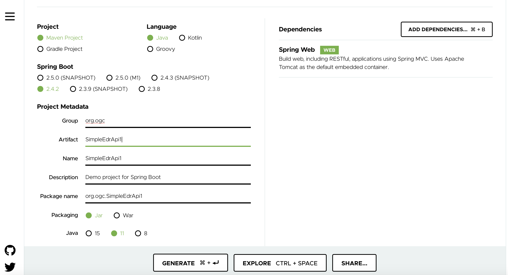
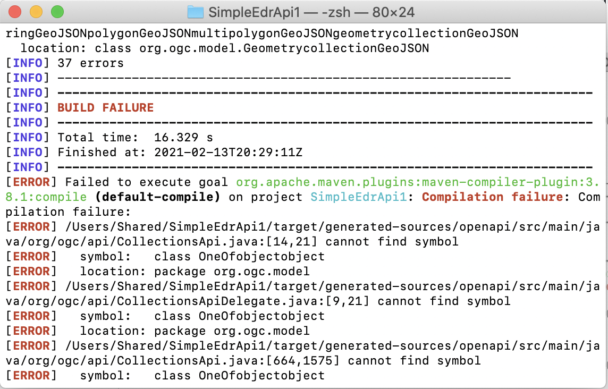
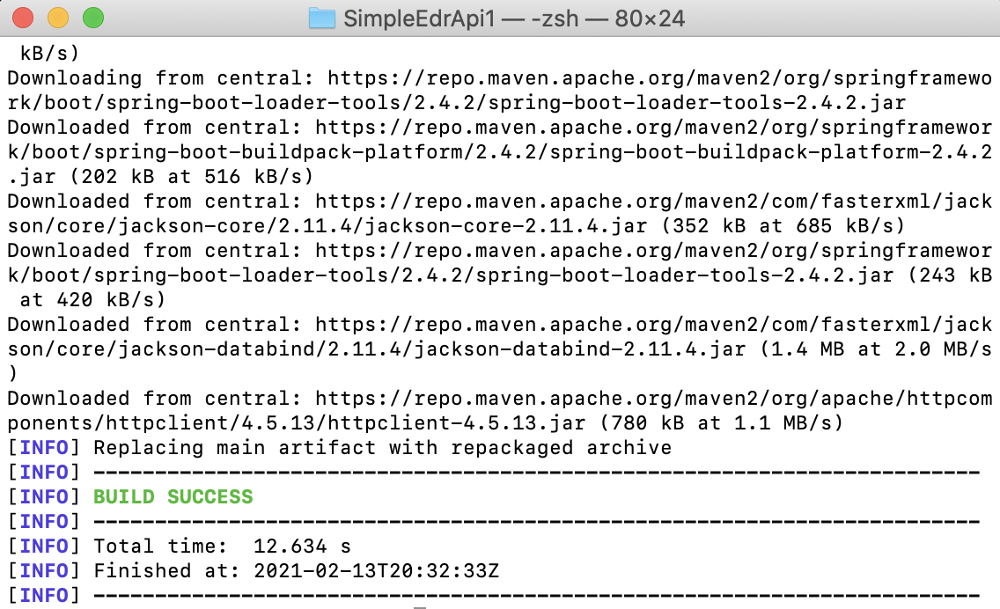

== Getting Started with the OGC API - Environmental Data Retrieval Draft Standard and Spring Boot

=== Introduction

This Getting Started guide introduces Java developers that use Spring to working with API definition files from the draft OGC API - Environmental Data Retrieval specification. The guide is inspired by the https://reflectoring.io/spring-boot-openapi/[API-First Development with Spring Boot and Swagger] tutorial on reflectoring.io.

== Prerequisites

* The Java Development Kit (JDK) should be installed on your machine. You can use either http://openjdk.java.net[OpenJDK] or https://www.oracle.com/java/technologies/javase-downloads.html[Oracle JDK].
* https://maven.apache.org/[Maven] should be available on your machine.
* An Integrated Development Environment (IDE). Some popular ones include https://www.eclipse.org[Eclipse], https://netbeans.org[Apache Netbeans], https://code.visualstudio.com[Microsoft Visual Code] and https://www.jetbrains.com/idea/download/[IntelliJ IDEA Community edition].

[[step1]]
== Step 1 - Creating a basic Spring boot application

First create a basic spring boot application at http://start.spring.io

Let's call the project SimpleEDRApi1.

Ensure that you select Spring Web as a dependency.

Download the project by clicking on the GENERATE button.

Notice that the project contains a class called `SimpleEDRApi1Application`. This is the Main Class for the application.

Now configure the application to run to serve requests through port 8081 by adding `server.port=8081` to the file `/src/main/resources/application.properties`. In this tutorial we use port 8081, you could use any port you wish.

[[step2]]
== Step 2 - Adding the OpenAPITools Generator to the maven project

Add the following to the pom.xml file.

[source,xml]
----
<plugin>
   <groupId>org.openapitools</groupId>
   <artifactId>openapi-generator-maven-plugin</artifactId>
   <version>4.2.3</version>
   <executions>
      <execution>
         <goals>
            <goal>generate</goal>
         </goals>
         <configuration>
            <inputSpec>
               ${project.basedir}/src/main/resources/openapi.yaml
            </inputSpec>
            <generatorName>spring</generatorName>
            <apiPackage>org.ogc.api</apiPackage>
            <modelPackage>org.ogc.model</modelPackage>
            <supportingFilesToGenerate>
               ApiUtil.java
            </supportingFilesToGenerate>
            <configOptions>
               <delegatePattern>true</delegatePattern>
            </configOptions>
         </configuration>
      </execution>
   </executions>
</plugin>

----

Then unpackage the zip file https://github.com/opengeospatial/joint-ogc-osgeo-asf-sprint-2021/tree/master/docs/ogcapi-edr/openapi.zip[openapi.zip] file at `/src/main/resources/` in your maven project. This zip file contains the openapi definition document and related schema files.

[[step3]]
== Step 3 - Adding supporting libraries to the project

We are next going to add a series of libraries to the pom.xml file. Some
of those libraries have the same version number, so to make it easier to
manage the version numbers we will add the version numbers to the
pom.xml file as properties. This is shown below.

[source,xml]
----
<properties>
<java.version>11</java.version>
…Additional properties go here…
</properties>
----

So the properties should look as follows.

[source,xml]
----
<properties>
   <java.version>11</java.version>
   <swagger-annotations-version>1.5.22</swagger-annotations-version>
   <jackson-version>2.10.2</jackson-version>
   <jackson-databind-nullable>0.2.1</jackson-databind-nullable>
</properties>
----

You will need to add the following libraries.

[source,xml]
----
<dependency>
   <groupId>org.springframework.boot</groupId>
   <artifactId>spring-boot-starter-validation</artifactId>
</dependency>
<dependency>
   <groupId>io.swagger</groupId>
   <artifactId>swagger-annotations</artifactId>
   <version>${swagger-annotations-version}</version>
</dependency>
<dependency>
   <groupId>org.openapitools</groupId>
   <artifactId>jackson-databind-nullable</artifactId>
   <version>${jackson-databind-nullable}</version>
</dependency>
<dependency>
   <groupId>com.fasterxml.jackson.jaxrs</groupId>
   <artifactId>jackson-jaxrs-base</artifactId>
   <version>${jackson-version}</version>
</dependency>
<dependency>
   <groupId>com.fasterxml.jackson.core</groupId>
   <artifactId>jackson-core</artifactId>
   <version>${jackson-version}</version>
</dependency>
<dependency>
   <groupId>com.fasterxml.jackson.core</groupId>
   <artifactId>jackson-annotations</artifactId>
   <version>${jackson-version}</version>
</dependency>
<dependency>
   <groupId>com.fasterxml.jackson.core</groupId>
   <artifactId>jackson-databind</artifactId>
   <version>${jackson-version}</version>
</dependency>
<dependency>
   <groupId>com.fasterxml.jackson.jaxrs</groupId>
   <artifactId>jackson-jaxrs-json-provider</artifactId>
   <version>${jackson-version}</version>
</dependency>
<dependency>
   <groupId>com.fasterxml.jackson.datatype</groupId>
   <artifactId>jackson-datatype-joda</artifactId>
   <version>${jackson-version}</version>
</dependency>
----

[[step4]]
== Step 4 - Building

Now compile the OpenAPI definition by running the command:

`$ mvn clean package`

This will generate a stub of the API. Due to a current limitation of
OpenAPITools Generator (see
https://github.com/OpenAPITools/openapi-generator/issues/5381) the
compilation fails to handle elements defined as ‘oneOf’ or 'allOf' options. So, you
will see a compilation such as shown below.

As a workaround, create the following classes in the
org.ogc.model package:

* AnyOfobjectstring.java
* OneOfobjectobject.java
* OneOfpointGeoJSONmultipointGeoJSONlinestringGeoJSONmultilinestringGeoJSONpolygonGeoJSONmultipolygonGeoJSONgeometrycollectionGeoJSON.java
* OneOfstringinteger.java

The classes do not need to implement any methods in them.

NOTE: These are the classes that the generated stubs are expecting...so ignore the unusual filenames.

Now re-compile the OpenAPI definition by running the command:

`$ mvn clean package`

If successful, you should arrive at a `BUILD SUCCESS` message.

[[step5]]
== Step 5 - Creating the Controller

At this point, you now have the API and model stub that you will need to
implement an interface that conforms to the OGC API - Environmental Data Retrieval Draft Standard.

In the ‘target’ folder you will find a folder called ‘generated-sources’
that includes stubs for the API controllers and model.

So we next override the methods provided by the API classes
generated by the OpenAPITools Generator. Overriding these methods
enables us to add business logic to those methods.

So we create a class called `SimpleEdrApi1Controller` to sit alongside the
`SimpleEdrApi1Application` that was created by the initializr on
start.sprint.io in <<step1>>.

Declare the `SimpleEdrApi1Controller` class as  RestController as shown below.

[source,java]
----
@RestController
public class SimpleEDRApi1Controller{

}
----

Next we create a method inside `SimpleEdrApi1Controller` that is going to save us sometime when creating links. Copy the `createLink` method to the `SimpleEdrApi1Controller` class.

[source,java]
----
public Link createLink(String title, String rel, String type, String href)
{
    Link link = new Link();
    link.setRel(rel);
    link.setType(type);
    link.setTitle(title);
    link.setHref(href);

    return link;
}
----

At this point, we might as add a global variable for storing the URL of the endpoint. Declare this string at the global level.

[source,java]
----
String endpoint = "http://localhost:8081";
----

Next copy the stub of the `DefaultApi.getLandingPage` method into the
`SimpleEdrApi1Controller` class. Then insert the following code inside the `SimpleEdrApi1Controller.getLandingPage` method.

[source,java]
----
LandingPage lp = new LandingPage();
lp.setTitle("OGC API - Environmental Data Retrieval tutorial");
lp.setDescription("An example of an implementation of OGC API - Environmental Data Retrieval using Spring.io");

lp.addLinksItem(createLink("this document","self", "application/json",endpoint+"?f=json"));
lp.addLinksItem(createLink("OGC API conformance classes implemented by this server","conformance","application/json",endpoint+"/conformance"));
lp.addLinksItem(createLink("Access the data","data","application/json",endpoint+"/collections"));

HttpHeaders headers = new HttpHeaders();
headers.add("Content-Type", "application/json");
ResponseEntity<LandingPage> re = new ResponseEntity<LandingPage>(lp, headers, HttpStatus.OK);
----

Follow a similar approach of overriding the API methods generated by the OpenAPITools Generator.

[[step6]]
== Step 6 - Running the application

Once you are through overriding the other API methods, run the Spring boot application with the following command.

$ mvn spring-boot:run

Now using a client application such as Postman, send a request to http://localhost:8081 to see the landing page. The response should be something like.

[source,json]
----
{
  "title": "OGC API - Environmental Data Retrieval using Spring.io tutorial",
  "description": "An example of an implementation of OGC API - Environmental Data Retrieval  using Spring.io",
  "links": [
    {
      "href": "http://localhost:8081?f=json",
      "rel": "self",
      "type": "application/json",
      "hreflang": null,
      "title": "this document",
      "length": null
    },
    {
      "href": "http://localhost:8081/conformance",
      "rel": "conformance",
      "type": "application/json",
      "hreflang": null,
      "title": "OGC API conformance classes implemented by this server",
      "length": null
    },
    {
      "href": "http://localhost:8081/collections",
      "rel": "data",
      "type": "application/json",
      "hreflang": null,
      "title": "Access the data",
      "length": null
    }
  ],
  "keywords": null,
  "provider": null,
  "contact": null
}
----
