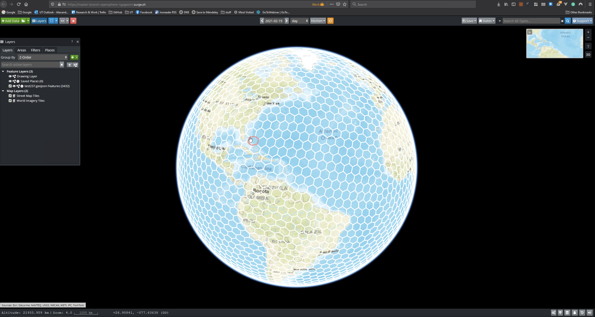
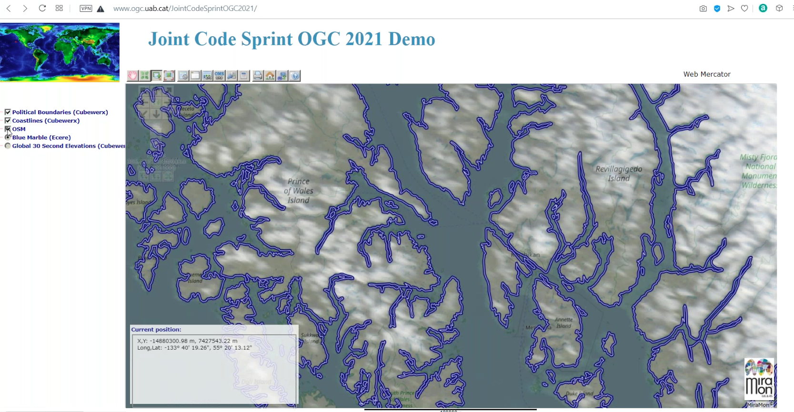
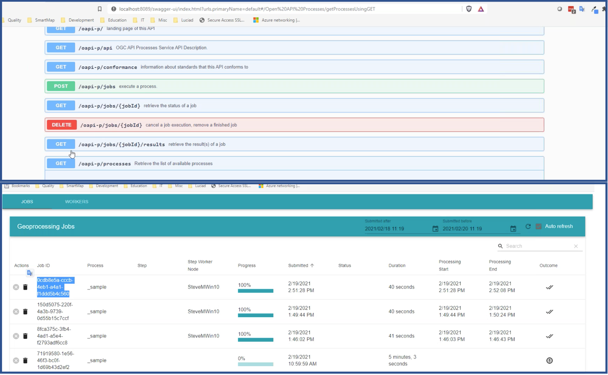
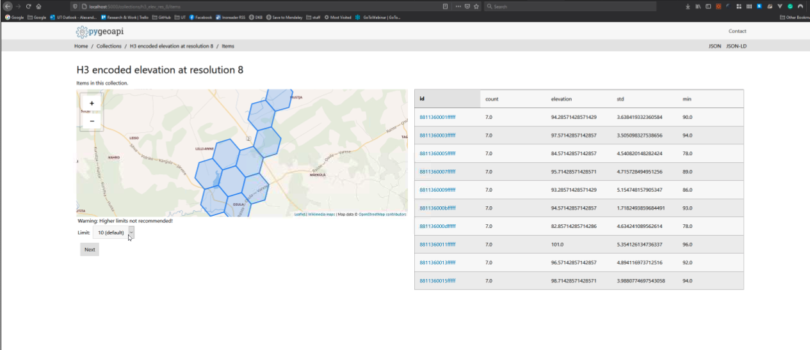
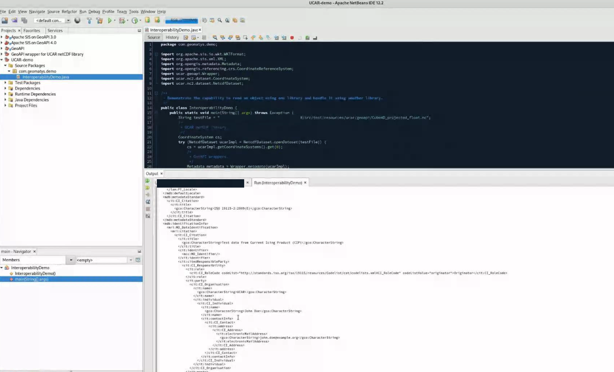
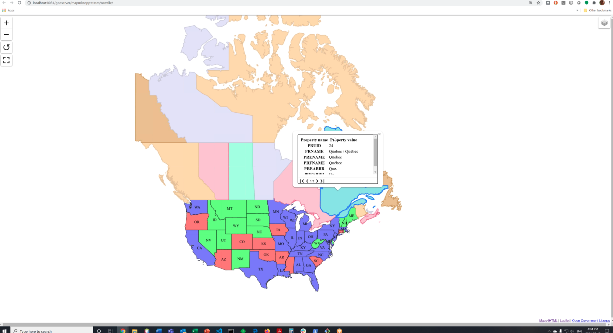
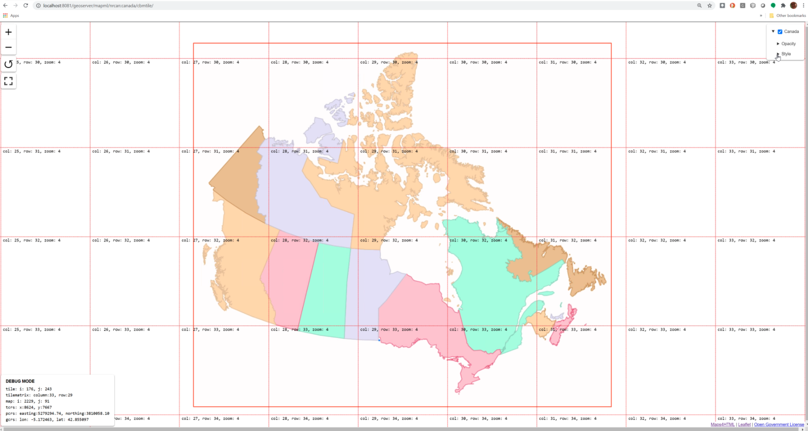
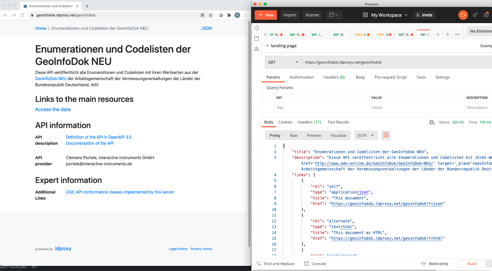
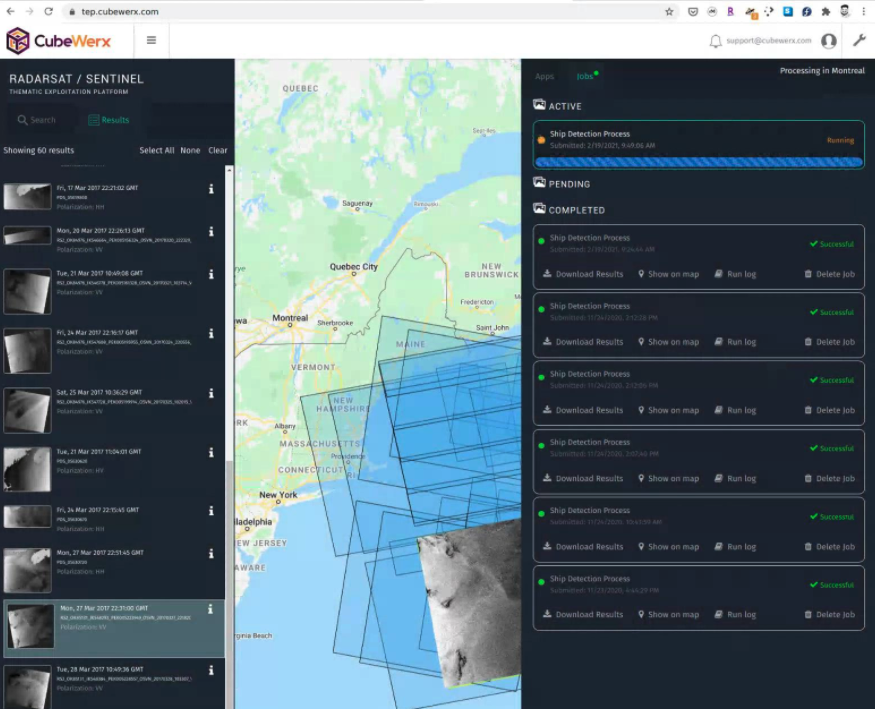

[[Results]]
== Results

The code sprint included multiple software libraries, OWS implementations, OGC API implementations and different client applications. In addition to supporting OWS and OGC API standards, various ASF and OSGeo software products involved in the code sprint also supported a variety of OGC encoding standards. This section presents some of the results from the code sprint.

<<img_openshere_dggs>> shows a screenshot of OpenSphere displaying a DGGS that had been uploaded as a GeoJSON-encoded feature collection. On the screenshot, one of the grid cells is highlighted after being clicked on.

[#img_openshere_dggs,reftext='{figure-caption} {counter:figure-num}']
.A screenshot of OpenSphere displaying a DGGS

<<img_miramon>> shows a screenshot of the UAB-CREAF MiraMon application accessing resources through OGC API - Tiles and OGC API- Maps interfaces. The client application is shown retrieving content from Ecere and CubeWerx servers.

[#img_miramon,reftext='{figure-caption} {counter:figure-num}']
.A screenshot of the UAB-CREAF MiraMon application accessing resources through OGC API - Tiles and OGC API- Maps interfaces

<<img_geoserver_styles>> shows a screenshot of the collections offered by a GeoServer implementation of OGC API - Styles. The screenshot shows a series of styles belonging to one of the collections. This organization of styles makes it possible to have different styles for different contexts (e.g. light, day, outdoor and so forth).

[#img_geoserver_styles,reftext='{figure-caption} {counter:figure-num}']
.A screenshot of the collections offered by a GeoServer implementation of OGC API - Styles
image::images/geoserver-ogcapi-styles.png[width=600,align="center"]

<<img_hexagon_processes>> shows two screenshots, one above the other. The upper screenshot shows the Swagger user interface (UI) of a prototype implementation of OGC API - Processes by Hexagon Geospatial. The lower screenshot shows a series of in-progress and completed jobs as monitored by the implementation.

[#img_hexagon_processes,reftext='{figure-caption} {counter:figure-num}']
.A screenshot of the Swagger UI of a prototype Hexagon implementation of OGC API - Processes

<<img_pygeoapi_dggs>> shows a screenshot of pygeoapi displaying part of the https://eng.uber.com/h3/[Uber H3] Hexagonal Hierarchical Geospatial Indexing System. H3 supports hierarchical tessellation of regular polygons at increasingly fine resolutions up to an areal size of square meters cite:[Bondaruk2019].

[#img_pygeoapi_dggs,reftext='{figure-caption} {counter:figure-num}']
.A screenshot of pygeoapi displaying a DGGS

<<img_geoserver_maps>> shows a screenshot of a map created from https://www.ordnancesurvey.co.uk/business-government/products/open-zoomstack[OS Open Zoomstack] using a GeoServer instance that supports OGC API - Maps. OS Open Zoomstack offers comprehensive basemap of Great Britain showing coverage from national level right down to street detail.

[#img_geoserver_maps,reftext='{figure-caption} {counter:figure-num}']
.A screenshot of a map created from OS Open Zoomstack using a GeoServer and OGC API - Maps (Contains OS data © Crown Copyright and database right 2020)
image::images/geoserver-ogcapi-maps.png[width=600,align="center"]

<<img_geoapi>> shows a screenshot of the NetBeans IDE running GeoAPI, Apache SIS and the UCAR netCDF library. The use of these three libraries demonstrated support for both the https://www.ogc.org/standards/geoapi[OGC GeoAPI] standard and the https://www.ogc.org/standards/netcdf[OGC netCDF] standard.

[#img_geoapi,reftext='{figure-caption} {counter:figure-num}']
.A screenshot of the NetBeans IDE running GeoAPI, Apache SIS and the UCAR netCDF library

<<img_pygeoapi1>> shows a screenshot of pygeoapi displaying a sample metadata record from the Dutch National GeoRegister.

[#img_pygeoapi1,reftext='{figure-caption} {counter:figure-num}']
.A screenshot of pygeoapi displaying a sample metadata record
image::images/pygeoapi1.png[width=600,align="center"]

<<img_geonetwork>> shows a screenshot of GeoNetwork and the download buttons (right-hand side of the screen) for different supported formats. As shown on the screenshot the formats included HTML, XML, JSON, RSS and JSON-LD structured according to the schema.org specification.

[#img_geonetwork,reftext='{figure-caption} {counter:figure-num}']
.A screenshot of the GeoNetwork user interface
image::images/geonetwork.png[width=600,align="center"]

<<img_mapml>> shows a screenshot of the MapML viewer built for GeoServer. The screenshot shows two separate layers in the same view, one showing part of the United States and the other showing Canada. The screenshot also shows a pop-up window triggered by a mouse click and revealing attributes about the clicked feature.

[#img_mapml,reftext='{figure-caption} {counter:figure-num}']
.A screenshot of the MapML viewer in GeoServer

<<img_mapml_grid>> shows an additional screenshot of the MapML viewer, with a grid placed above the map layers.

[#img_mapml_grid,reftext='{figure-caption} {counter:figure-num}']
.A gridded screenshot of the MapML viewer built for GeoServer

<<img_ldproxy>> shows a screenshot of the landing page of an ldproxy instance that publishes data from the National Mapping Agency of the Federal Republic of Germany. The screenshot demonstrates the content negotiation capabilities supported by OGC APIs that enable a client application such as a web browser to request a resource in HTML and a different client application such as a developer utility (e.g. https://www.postman.com[postman]) to request the same resource in JSON.

[#img_ldproxy,reftext='{figure-caption} {counter:figure-num}']
.A screenshot of the landing page of an ldproxy instance accessed using a web browser (left) and postman (right)

<<img_cubewerx>> shows a screenshot of the CubeWerx Ship Detection processes running on Sentinel data in the Amazon Web Services Cloud. Available input datasets are listed on the left-hand side of the figure, whereas in-progress and completed jobs are listed on the right-hand side of the figure.

[#img_cubewerx,reftext='{figure-caption} {counter:figure-num}']
.A screenshot of the CubeWerx processes management tool

<<img_cubewerx2>> presents example output from the CubeWerx Ship Detection processes. The positions of detected ships are shown by the red markers.

[#img_cubewerx2,reftext='{figure-caption} {counter:figure-num}']
.Example output from the CubeWerx Ship Detection processes
image::images/cubewerx2.png[width=600,align="center"]

<<img_pygeoapi_xarray>> shows a screenshot of an x-array supported pygeoapi displaying a coverage. The coverage is accessed through an OGC API - Coverages interface and has been styled for portrayal purposes. The demonstration showed how OGC API - Tiles could be implemented alongside OGC API - Coverages to enable access to tiled coverage data.

[#img_pygeoapi_xarray,reftext='{figure-caption} {counter:figure-num}']
.A screenshot of an x-array supported pygeoapi displaying a coverage
image::images/pygeoapi-xarray.png[width=600,align="center"]
